# TachiyomiSY Developer Documentation

## Table of Contents
1. [Git Workflows](#git-workflows)
2. [Branch & Release Workflows (Visual)](#branch--release-workflows-visual)
3. [GitHub Actions Workflows](#github-actions-workflows)
4. [Release Process](#release-process)
5. [Quick Reference](#quick-reference)

---

## Git Workflows

### Main Branches

| Branch | Purpose | Protection |
|--------|---------|-----------|
| `master` | Production stable branch | No direct pushes required |
| `develop` | Development integration branch | No direct pushes required |
| `release` | Triggers production releases | Auto-builds and publishes on push |
| `preview` | Triggers preview builds | Auto-builds preview versions on push |

### Feature Branches

Use descriptive branch naming conventions:
- `fix/*` - Bug fixes (e.g., `fix/memory-leak-crash`)
- `feature/*` - New features (e.g., `feature/dark-mode`)
- `chore/*` - Maintenance tasks (e.g., `chore/update-dependencies`)
- `hotfix/*` - Urgent production fixes (e.g., `hotfix/critical-security`)

### Commit Conventions

While not strictly enforced, commits follow [Conventional Commits](https://www.conventionalcommits.org/) format:

```text
type(scope): subject

body

footer
```

**Supported types**:
- `feat:` - New feature
- `fix:` - Bug fix
- `ci:` - CI/CD changes
- `chore:` - Maintenance, dependency updates
- `refactor:` - Code refactoring
- `docs:` - Documentation changes
- `test:` - Test additions/modifications
- `perf:` - Performance improvements

**Example commits**:
```
feat: add category PIN locking
fix: crash when loading manga with special characters
ci: optimize gradle build caching
chore: update dependencies to latest versions
```

### Branch Protection

Branches are protected through GitHub Actions workflow triggers:
- **Pull Requests** on `master` and `develop` require `build_check` to pass
- **Push to `release`** triggers production build and release
- **Push to `preview`** triggers preview build

---

## Branch & Release Workflows (Visual)

### Branch Structure & Feature Development


### Pull Request Workflow


#### Quick Commands: Feature Development

**Step 1: Create and checkout feature branch**
```bash
# Create from develop (always pull latest first)
git checkout develop
git pull origin develop

# Create feature branch
git checkout -b feature/my-feature-name
# or for bug fixes
git checkout -b fix/bug-description
# or for maintenance
git checkout -b chore/update-something
```

**Step 2: Make changes and commit**
```bash
# Make your changes to files...

# Stage changes
git add .

# Commit with conventional message
git commit -m "feat: add new feature description"
# or
git commit -m "fix: resolve crash when doing X"
# or
git commit -m "chore: update dependencies"

# Commit multiple related changes
git commit -m "feat: implement feature

- Added component X
- Updated service Y
- Added tests"
```

**Step 3: Push and create PR**
```bash
# Push branch to remote
git push -u origin feature/my-feature-name

# GitHub will prompt with PR link, or visit:
# https://github.com/tachiyomisx/TachiyomiSY/pull/new/feature/my-feature-name

# Or use GitHub CLI
gh pr create --title "Add my feature" --body "Description of changes" --base develop
```

**Step 4: Address CI failures**
```bash
# If build_check.yml or test.yml fails, fix locally
git add .
git commit -m "fix: address CI failures"
git push

# CI will automatically re-run on new commit
```

**Step 5: Merge after approval**
```bash
# After code review approval, merge to develop
# Can be done via GitHub UI or CLI:

# Squash merge (recommended for develop - keeps history clean):
gh pr merge <PR_NUMBER> --squash --base develop

# Or merge commit (alternative):
gh pr merge <PR_NUMBER> --merge --base develop
```

### Quick Commands: Creating a PR

**Complete workflow in 5 commands**:
```bash
# 1. Create and checkout feature branch
git checkout -b feature/add-dark-mode

# 2. Make changes to your files...
# 3. Commit changes
git add .
git commit -m "feat: add dark mode toggle"

# 4. Push to remote
git push -u origin feature/add-dark-mode

# 5. Create PR (via GitHub UI or CLI)
gh pr create --title "Add dark mode" --base develop
```

**After PR is created**:
- ✅ `build_check.yml` runs automatically
- ✅ `test.yml` runs automatically
- ✅ Results appear as PR comments
- ✅ If failures: fix locally, push new commits
- ✅ After approval: merge to develop

---

### Release Process & Automation

```mermaid
graph TD
    A["📋 Update Version<br/>app/build.gradle.kts<br/>versionName = 1.12.1"] -->|git add & commit| B["📝 Commit Change<br/>bump: version to 1.12.1"]
    B -->|git push origin| C["release branch<br/>Trigger build_push.yml"]

    C -->|Step 1| D1["📥 Checkout + History<br/>fetch-depth: 0"]
    D1 -->|Step 2| D2["🏷️ Extract Version<br/>v1.12.1"]
    D2 -->|Step 3| D3["🔍 Validate Tag<br/>v1.12.1 not exists?"]

    D3 -->|Yes| D4["✅ Tag Valid<br/>Continue build"]
    D3 -->|No| D5["❌ Duplicate Tag<br/>Build fails"]
    D5 -->|Fix| A

    D4 -->|Step 4| D6["🔨 Build & Test<br/>assembleStandardRelease"]
    D6 -->|Step 5| D7["🔐 Sign APK<br/>5 variants"]
    D7 -->|Step 6| D8["📖 Get Previous Tag<br/>v1.12.0"]
    D8 -->|Step 7| D9["📝 Generate Changelog<br/>Commits between tags"]

    D9 -->|Step 8| D10["🚀 Create GitHub Release<br/>tag: v1.12.1"]
    D10 -->|Body includes| D11["✨ Auto Changelog<br/>Features/Fixes/Maintenance"]
    D11 -->|Step 9| D12["📦 Upload 5 APKs<br/>Universal + arch-specific"]
    D12 -->|Step 10| D13["🔓 Auto-Publish<br/>draft: false"]

    D13 -->|Published| D14["🎉 Release Live<br/>Watchers notified"]
    D14 -->|Available| D15["⬇️ GitHub Releases<br/>Download APKs"]

    style A fill:#fff3e0,stroke:#ff6f00
    style C fill:#e8f5e9,stroke:#28a745
    style D3 fill:#ffe0e0,stroke:#ff0000
    style D4 fill:#c8e6c9,stroke:#28a745
    style D5 fill:#ffcdd2,stroke:#c62828
    style D13 fill:#e0e2f1,stroke:#3f51b5
    style D14 fill:#c8e6c9,stroke:#28a745
    style D15 fill:#b3e5fc,stroke:#0288d1
```



### CI/CD Pipeline Overview

```mermaid
graph TB
    PR["📤 Pull Request<br/>(not master/develop)"]
    PUSH_REL["📤 Push to<br/>release branch"]
    PUSH_PREV["📤 Push to<br/>preview branch"]

    PR -->|Trigger| BUILD_CHECK["build_check.yml<br/>Compile + Spotless"]
    PR -->|Trigger| TEST["test.yml<br/>Unit tests"]
    BUILD_CHECK -->|Pass/Fail| PR_COMMENT["Comment on PR<br/>Build status + APK size"]
    TEST -->|Pass/Fail| PR_COMMENT

    PUSH_REL -->|Trigger| BUILD_PUSH["build_push.yml<br/>Release Builder"]
    BUILD_PUSH -->|Extract version| VER["Version: v1.12.1"]
    VER -->|Validate| VALIDATE["Tag not exists?"]
    VALIDATE -->|Yes| COMPILE["Compile + Test + Sign"]
    VALIDATE -->|No| FAIL["Build fails"]
    COMPILE -->|Success| CHANGELOG["Generate Changelog<br/>from commits"]
    CHANGELOG -->|Create| RELEASE["GitHub Release<br/>with APKs"]
    RELEASE -->|Publish| LIVE["🚀 Live Release<br/>Auto-published"]
    FAIL -->|Error message| FIX["Fix & retry"]

    PUSH_PREV -->|Trigger| BUILD_PREVIEW["build_push_preview.yml<br/>Preview Builder"]
    BUILD_PREVIEW -->|Build| PREVIEW["Preview Release<br/>tag: preview-X"]

    style PR fill:#e3f2fd,stroke:#1976d2
    style PUSH_REL fill:#fff3e0,stroke:#ff6f00
    style PUSH_PREV fill:#f3e5f5,stroke:#7b1fa2
    style BUILD_CHECK fill:#c8e6c9,stroke:#388e3c
    style TEST fill:#c8e6c9,stroke:#388e3c
    style BUILD_PUSH fill:#ffe0b2,stroke:#e65100
    style LIVE fill:#b2dfdb,stroke:#00695c
    style FAIL fill:#ffcdd2,stroke:#d32f2f
```



#### Quick Commands: Release (Trigger Production Build)

**One-command release workflow**:
```bash
# Step 1: Update version in app/build.gradle.kts
# Edit line 36: versionName = "1.12.1"
# Edit line 35: versionCode = 76 (increment by 1)

# Step 2: Commit and push to release branch (3 commands)
git add app/build.gradle.kts
git commit -m "bump: version to 1.12.1"
git push origin release

# That's it! The workflow does the rest:
# ✅ Extracts version v1.12.1
# ✅ Validates tag doesn't exist
# ✅ Builds & tests
# ✅ Signs APKs
# ✅ Generates changelog
# ✅ Creates GitHub release
# ✅ Publishes automatically
```

**Check release status**:
```bash
# View running workflow
# https://github.com/tachiyomisx/TachiyomiSY/actions/workflows/build_push.yml

# View released version
# https://github.com/tachiyomisx/TachiyomiSY/releases

# Download APKs
# Universal: TachiyomiSY.apk
# ARM64: TachiyomiSY-arm64-v8a.apk
# ARMv7: TachiyomiSY-armeabi-v7a.apk
# x86: TachiyomiSY-x86.apk
# x86_64: TachiyomiSY-x86_64.apk
```

**If tag collision error**:
```bash
# Error: Tag v1.12.1 already exists!
# Solution: Increment version again

# Edit app/build.gradle.kts
# versionName = "1.12.2"  (changed from 1.12.1)
# versionCode = 77

# Retry:
git add app/build.gradle.kts
git commit -m "bump: version to 1.12.2"
git push origin release
```

---

### Quick Commands: Other Common Tasks

**View latest version**:
```bash
grep 'versionName = ' app/build.gradle.kts | awk -F'"' '{print $2}'
# Output: 1.12.0
```

**View all semantic version tags**:
```bash
git tag | grep -E '^v?[0-9]+\.[0-9]+\.[0-9]+$' | sort -V
# Output: v1.12.0, v1.12.1, etc.
```

**View last released version**:
```bash
git tag --sort=-version:refname | grep -E '^v?[0-9]+\.[0-9]+\.[0-9]+' | head -1
# Output: 1.12.0 (latest semantic version)
```

**Reset local develop to remote**:
```bash
git fetch origin
git checkout develop
git reset --hard origin/develop
```

**Delete local branch after merge**:
```bash
git branch -d feature/my-feature
```

**View workflow runs**:
```bash
# GitHub CLI (requires installation)
gh run list --workflow build_push.yml

# Or visit:
# https://github.com/tachiyomisx/TachiyomiSY/actions
```

---

## GitHub Actions Workflows

### Overview

TachiyomiSY uses 6 automated workflows to ensure code quality and streamline releases:

| Workflow | Trigger | Purpose |
|----------|---------|---------|
| `build_check.yml` | Pull requests (except master/develop) | Verify code compiles and passes checks |
| `test.yml` | Pull requests | Run unit tests with coverage reports |
| `build_push.yml` | Push to `release` branch | Build, sign, and publish production releases |
| `build_push_preview.yml` | Push to `preview` branch | Build and publish preview versions |
| `pr_label.yml` | Pull request opened | Auto-label translation-related PRs |
| `issue_moderator.yml` | Issue creation | Auto-label and monitor issues |

### Detailed Workflow Documentation

#### 1. build_check.yml - PR Build Verification

**Trigger**: Pull requests (excluding master/develop branches)

**Purpose**: Verify code compiles and passes style checks before review

**What it does**:
- Checks out code
- Sets up Java 17 and Gradle cache
- Runs Spotless code style checking
- Assembles a debug APK
- Uploads APK as artifact for 7 days
- Comments on PR with build status and APK size

**Key Features**:
- Gradle memory optimization: `-Xmx3g` heap, `-XX:MaxMetaspaceSize=768m`
- Concurrent build cancellation: cancels previous builds if new commit is pushed
- G1GC garbage collector with string deduplication
- APK available in workflow artifacts for testing

**Outputs**:
- ✅ Build status comment on PR
- 📦 APK artifact (7-day retention)
- 📊 APK file size information

---

#### 2. test.yml - Unit Tests & Coverage

**Trigger**: Pull requests

**Purpose**: Run comprehensive unit tests with coverage reports

**What it does**:
- Runs unit tests for all test configurations
- Generates test reports and coverage metrics
- Comments on PR with test results
- Fails if coverage drops below thresholds

**Key Features**:
- Multi-configuration testing (debug, release variants)
- Coverage reporting integration
- Test failure summaries in PR comments

**Outputs**:
- 🧪 Test results and coverage reports
- 📈 Coverage metrics in PR comments

---

#### 3. build_push.yml - Release Builder ⭐

**Trigger**: Push to `release` branch

**Purpose**: Build, sign, test, and publish production releases to GitHub Releases

**What it does**:
1. Checks out full git history (for changelog generation)
2. Extracts version from `app/build.gradle.kts`
3. Validates that version tag doesn't already exist
4. Sets up Android SDK and Java 17
5. Compiles code with Spotless checks
6. Runs unit tests
7. Assembles signed APK variants
8. Generates changelog from commits since last release
9. Creates GitHub release with semantic version tag
10. Publishes APKs automatically

**Key Features**:
- Semantic version tags from source (e.g., `v1.12.0`, `v1.12.1`)
- Automatic changelog generation from commits
- Auto-published releases (not drafts)
- 5 APK variants: universal, arm64-v8a, armeabi-v7a, x86, x86_64
- Gradle memory optimization
- Concurrency control prevents duplicate builds

**Build Artifacts** (signed and released):
- `TachiyomiSY.apk` - Universal APK (recommended)
- `TachiyomiSY-arm64-v8a.apk` - ARM64 optimized
- `TachiyomiSY-armeabi-v7a.apk` - ARMv7 compatible
- `TachiyomiSY-x86.apk` - x86 architecture
- `TachiyomiSY-x86_64.apk` - x86-64 architecture

**Version Management**:
- Read from: `app/build.gradle.kts` line 36 (`versionName = "1.12.0"`)
- Tag format: `v{versionName}` (e.g., `v1.12.0`)
- Validation: Fails if tag already exists (prevents duplicate releases)

**Outputs**:
- 🏷️ Semantic version tag (v1.12.0)
- 📝 Auto-generated changelog (categorized by type)
- 🚀 Published GitHub release with APKs
- 📦 Downloadable APK files

---

#### 4. build_push_preview.yml - Preview Builder

**Trigger**: Push to `preview` branch

**Purpose**: Build and publish preview versions for testing

**What it does**:
- Similar to build_push.yml but for preview branch
- Creates preview releases with different naming
- May use different signing or build variants

**Outputs**:
- Preview APK artifacts
- Preview release documentation

---

#### 5. pr_label.yml - Translation PR Auto-Labeling

**Trigger**: Pull request opened

**Purpose**: Automatically label translation-related pull requests

**What it does**:
- Detects translation file modifications
- Applies `translation` label automatically
- Helps organize PRs by type

**Outputs**:
- 🏷️ Auto-applied labels on PRs

---

#### 6. issue_moderator.yml - Issue Moderation

**Trigger**: Issue creation

**Purpose**: Automatically organize and label new issues

**What it does**:
- Applies category labels
- Leaves welcome comment
- Helps triage incoming issues

**Outputs**:
- 🏷️ Auto-applied issue labels
- 📝 Welcome comments

---

## Release Process

### For Maintainers

#### Step 1: Update Version

Edit `app/build.gradle.kts` (lines 35-36):

```kotlin
versionCode = 75        // Increment by 1
versionName = "1.12.1"  // Update version (semantic versioning)
```

**Version Format**: `MAJOR.MINOR.PATCH`
- `MAJOR`: Major version changes (e.g., 1.0.0 → 2.0.0)
- `MINOR`: Feature additions (e.g., 1.12.0 → 1.13.0)
- `PATCH`: Bug fixes (e.g., 1.12.0 → 1.12.1)

#### Step 2: Commit and Push to Release Branch

```bash
# Checkout release branch (not master)
git checkout release
git pull origin release

# Update version
git add app/build.gradle.kts
git commit -m "bump: version to 1.12.1"
git push origin release
```

#### Step 3: GitHub Actions Automatically

✅ **Automatically performed by `build_push.yml`**:

1. Checks out full repository history
2. Extracts version from `app/build.gradle.kts` → `v1.12.1`
3. **Validates**: Checks if tag `v1.12.1` already exists
   - If exists: Build fails with clear error message
   - If not: Proceeds to build
4. Compiles app with tests
5. Runs Spotless code style checks
6. Runs unit tests
7. Assembles 5 APK variants
8. Signs APKs with release key
9. **Generates changelog** from commits since last release:
   - Groups by type: Features, Bug Fixes, Maintenance, Translations
   - Extracts commit messages using conventional commits
   - Filters out noise (dependency updates, etc.)
10. Creates GitHub release with:
    - Tag: `v1.12.1`
    - Title: `TachiyomiSY v1.12.1`
    - Body: Auto-generated changelog + installation instructions
    - APK files: All 5 variants
11. **Publishes automatically** (not as draft)
12. GitHub notifies watchers of new release

#### Step 4: Verify Release (Optional)

Visit: <https://github.com/tachiyomisx/TachiyomiSY/releases>

You should see:
- Latest release: `v1.12.1`
- Auto-generated changelog with sections
- 5 downloadable APK variants
- Installation instructions

### Changelog Generation

The workflow automatically generates a changelog by analyzing commits since the last release:

**Categories**:
- 🎉 **Features** - New functionality (commit: `feat:`)
- 🐛 **Bug Fixes** - Bug fixes (commit: `fix:`)
- 🔧 **Maintenance** - Dependency updates, build changes (commit: `chore:`, `ci:`)
- 🌍 **Translations** - Language/translation updates
- ✨ **Other Changes** - Miscellaneous changes

**Example Changelog**:
```markdown
## What's Changed

### 🎉 Features
- Add category PIN locking (#123)
- Implement persistent download queue with retry logic (#124)

### 🐛 Bug Fixes
- Fix crash when loading manga with special characters
- Memory leak in library view

### 🔧 Maintenance
- Update Kotlin to 1.9.0
- Optimize Gradle build caching

### Full Changelog
https://github.com/tachiyomisx/TachiyomiSY/compare/v1.12.0...v1.12.1
```

### Version Tags

**Format**: `vX.Y.Z` (semantic versioning with `v` prefix)

**Examples**:
- `v1.12.0` - First release of 1.12
- `v1.12.1` - Patch release (bug fixes)
- `v1.13.0` - Minor release (new features)
- `v2.0.0` - Major release (breaking changes)

**How it works**:
1. Version extracted from `app/build.gradle.kts`
2. Automatically converted to tag format: `v{version}`
3. Tag is created and pushed to GitHub automatically
4. Release is published with this tag

**Tag Validation**:
- Before building, workflow checks if tag already exists
- If tag exists: Build fails with error message
  ```
  ::error::Tag v1.12.1 already exists!
  ::error::Please increment the version in app/build.gradle.kts
  ```
- Prevents accidental duplicate releases

### Release Publishing

**Automatic Publishing**:
- Releases are **automatically published** (not drafts)
- No manual intervention needed
- GitHub automatically notifies all watchers
- Release becomes immediately available for download

**Contents**:
- 5 APK variants (universal + architecture-specific)
- Auto-generated changelog
- Installation instructions
- Full commit history link

### Important Notes

⚠️ **Before pushing to release branch**:
1. Ensure version in `app/build.gradle.kts` is incremented
2. Ensure `versionCode` is incremented by 1
3. Ensure all changes are in the correct branch

⚠️ **If build fails**:
1. Check error message for specific issue
2. Fix the problem locally
3. Increment version again
4. Push to release branch again

💡 **For testing before full release**:
1. Use `draft: true` in workflow configuration
2. Publish draft manually
3. Once tested, change to `draft: false` for auto-publishing

---

## Quick Reference

### Common Commands

#### Triggering a Release

```bash
# Checkout release branch
git checkout release
git pull origin release

# Update version in app/build.gradle.kts
# - Increment versionCode by 1
# - Update versionName (e.g., 1.12.0 → 1.12.1)

# Stage changes
git add app/build.gradle.kts

# Commit with semantic message
git commit -m "bump: version to 1.12.1"

# Push to release branch (triggers build_push.yml)
git push origin release

# Monitor build progress
# Visit: https://github.com/tachiyomisx/TachiyomiSY/actions/workflows/build_push.yml
```

#### Checking Build Status

```bash
# View GitHub Actions
# https://github.com/tachiyomisx/TachiyomiSY/actions

# View specific workflow
# https://github.com/tachiyomisx/TachiyomiSY/actions/workflows/build_push.yml

# View all releases
# https://github.com/tachiyomisx/TachiyomiSY/releases
```

#### Version Extraction (Local Testing)

```bash
# Extract current version from build.gradle.kts
cd /Users/fajar.firdaus/Documents/Android\ Studio/TachiyomiSY
grep 'versionName = ' app/build.gradle.kts | awk -F'"' '{print $2}'
# Expected output: 1.12.0
```

#### Finding Artifacts

**In GitHub Actions workflow**:
- Run failed? Check logs at: `Actions → Workflow → Run → Logs`
- Build artifacts available for: 7 days (PR builds)
- Release artifacts: Permanently at GitHub Releases

**APK downloads**:
- <https://github.com/tachiyomisx/TachiyomiSY/releases>
- Download `TachiyomiSY.apk` for most devices
- Download architecture-specific for optimized performance

---

## Troubleshooting

### Release Build Failed: "Tag already exists"

**Error**:
```
::error::Tag v1.12.1 already exists!
::error::Please increment the version in app/build.gradle.kts
```

**Solution**:
1. Increment version in `app/build.gradle.kts`
2. Commit changes
3. Push to release branch again

**Why it happens**:
- You tried to release with the same version twice
- Version number in gradle file wasn't updated

---

### Changelog is Empty or Minimal

**Possible causes**:
1. No commits since last tag
2. Commits don't follow conventional commit format
3. All commits are filtered as "noise"

**Solution**:
- Add commits with proper conventional format before next release
- Ensure commit messages are descriptive

---

### APK Not Signed

**Check**:
1. Are signing secrets configured in GitHub?
2. Is the workflow reaching the "Sign APK" step?

**Solution**:
- Verify `secrets.SIGNING_KEY`, `secrets.ALIAS`, etc. are set
- Check workflow logs for specific error

---

### Gradle Build Memory Issues

**Error**:
```
java.lang.OutOfMemoryError: Java heap space
```

**Solution** (usually automatic):
- Workflow already optimizes memory with `-Xmx3g`
- G1GC garbage collector is configured
- String deduplication is enabled

**If still occurs**:
- Increase heap size in workflow (not recommended)
- Split build into multiple jobs

---

## Workflow Files

### Key Files

| File | Purpose |
|------|---------|
| `app/build.gradle.kts` | Version source (line 36) |
| `.github/workflows/build_push.yml` | Release automation |
| `.github/workflows/build_check.yml` | PR verification |
| `.github/workflows/test.yml` | Unit tests |
| `.github/workflows/build_push_preview.yml` | Preview builds |
| `.github/workflows/pr_label.yml` | Auto-labeling |
| `.github/workflows/issue_moderator.yml` | Issue moderation |
| `.github/changelog-config.json` | Changelog categories |

---

## Next Steps

For more detailed information about specific workflows, refer to the workflow files in `.github/workflows/`.

For questions or issues, check existing GitHub Issues or create a new one with the `documentation` label.

---

*Last updated: January 2026*
*Documentation for TachiyomiSY release and development workflows*
